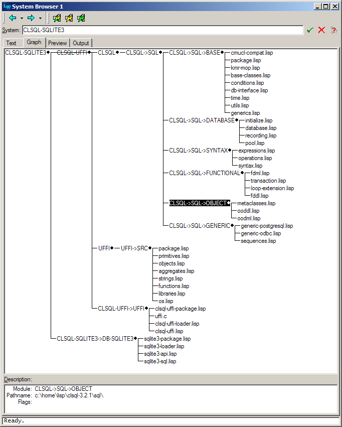

# LW-ADD-ONS

## Table of Contents

- [1 LW-ADD-ONS ASDF System Details][090a]
- [2 Compatibility with different LispWorks releases][a748]
- [3 Installation][076f]
- [4 Overview][8f10]
    - [4.1 Symbol Completion][1bba]
    - [4.2 Information about the arguments of a function][6607]
    - [4.3 Apropos dialog][37d2]
    - [4.4 Transient mark mode][0dd5]
    - [4.5 Search and replace][3f0d]
    - [4.6 Online documentation][dfd0]
    - [4.7 ASDF integration][6d71]
    - [4.8 Quicklisp integration][6128]
    - [4.9 Listener shortcuts][658f]

###### \[in package LW-ADD-ONS\]
[`LW-ADD-ONS`][090a] is a collection of small "enhancements" to
the [LispWorks](http://www.lispworks.com/) IDE that I
usually load from my initialization file. Most of this code is
intended to make LispWorks behave similar
to [SLIME](http://common-lisp.net/project/slime/) and [GNU Emacs](http://www.gnu.org/software/emacs/emacs.html).

The details of what's included are outlined below. (Whether
one thinks these are enhancements or rather distractions is of course
a matter of taste.)

The code has been used and tested on LispWorks for Windows mostly (I
don't use the IDE on Linux), but I hear there are also some Mac
hackers using it successfully.  For an overview of which LispWorks
releases are supported, see [Compatibility with different LispWorks releases][a748] section.

It comes with a [BSD-style license](http://www.opensource.org/licenses/bsd-license.php)
so you can basically do with it whatever you want.

## 1 LW-ADD-ONS ASDF System Details

- Version: 0.10.3

## 2 Compatibility with different LispWorks releases

[`LW-ADD-ONS`][090a] was originally (in 2005) conceived and written for
LispWorks 4.4.5/4.4.6 (and it will likely not work with older
versions).  Since then, the fine LispWorks hackers have added several
new features to their IDE which rendered some parts of [`LW-ADD-ONS`][090a]
obsolete.  As I usually use the latest LispWorks version, you can
expect [`LW-ADD-ONS`][090a] to be adapted to it pretty soon after its release.
This might include dropping features which are now superseded by
capabilities offered by the LispWorks IDE itself.

The newest LispWorks release which is currently supported is 7.0.
Support for older LispWorks versions might at some point disappear.
Keep your old [`LW-ADD-ONS`][090a] tarballs if you plan on sticking with a
certain LispWorks release.

## 3 Installation

To use [`LW-ADD-ONS`][090a] you need `LW-DOC` and a recent version of
LispWorks:

<http://weitz.de/lw-doc/>
  <http://www.lispworks.com/>

Use of [Quicklisp](http://www.quicklisp.org) is recommended together
with [LispWorks distribution](https://ultralisp.org/dists/lispworks).

If you already have a LispWorks init file, append the included file
`.lispworks' to it, otherwise instruct LispWorks to use this file as
your initialization file.  In that file, modify the special variables
`*ASDF-BASE-DIRS*`, and`*WORKING-DIR*`to fit your local settings.
Specifically, make sure that LW-ADD-ONS, LW-DOC and their supporting
libraries can be found via`*ASDF-BASE-DIRS*\`.

Download the `HTML` page <http://www.lisp.org/mop/dictionary.html> and
store it locally.  At the end of the init file (after [`LW-ADD-ONS`][090a] has
been loaded) set the value of [`LW-ADD-ONS:*MOP-PAGE*`][4f97] to the pathname of
the saved `HTML` file.  (There are some other special variables that can
be used to modfiy the behaviour of [`LW-ADD-ONS`][090a].  See the documentation
for details.)

You should now be able to use [`LW-ADD-ONS`][090a] by simply starting LispWorks.

Note: The Personal Edition of LispWorks doesn't support the automatic
loading of initialization files.  You'll have to use some kind of
workaround.

## 4 Overview

Here's an overview of what's currently in [`LW-ADD-ONS`][090a].  If you want
more details you got to look at the source code which should be
reasonably documented.

### 4.1 Symbol Completion

Symbol completion is divided into two editor commands. The "outer" command is
[`Indent And Complete Symbol`][792b] which tries to indent the current line
and only performs completion if the line hasn't changed. I have bound this command
to the `TAB` key in my init file, so I can use `TAB` for both indentation and completion.
(In LispWorks 7.0 the editor command [`Indent Selection or Complete Symbol`][390b]
was introduced, so you probably no longer need my workaround.)

The "inner" command is [`Complete Symbol Without Dialog`][1568] which is intended to work
more or less like SLIME's `SLIME-COMPLETE-SYMBOL*` function, i.e. you can type, e.g., `m-v-b`
and it'll be expanded to `MULTIPLE-VALUE-BIND`. If there's more than one possible completion,
then the command only performs completion up to the longest unambiguous prefix and shows
a list of (some of) the possible completions in the echo area. There's no GUI dialog popping
up because I think that's distracting.

[`Indent And Complete Symbol`][792b] calls [`Complete Symbol Without Dialog`][1568] on LispWorks
4.4.x and 5.0.x. In 5.1, however, the new command [`Abbreviated Complete Symbol`][5d5a] was introduced
by LispWorks, so now you can decide which function should be used via the special
variable [`*USE-ABBREVIATED-COMPLETE-SYMBOL*`][9aef].

If it can be determined that you're within a string then [`Indent And Complete Symbol`][792b]
tries pathname completion instead. (This is not perfect, though, as it won't work if
the string contains spaces.)

If the symbol which is completed denotes a function without arguments, [`Complete Symbol Without Dialog`][1568]
will automatically add a closing parenthesis. This can be customized through the variable
`*INSERT-RIGHT-PARENTHESIS-IF-NO-ARGS*`.

You can customize the behavior of [`Complete Symbol Without Dialog`][1568] by changing
the value of the variable [`*COMPLETION-MATCH-FUNCTION*`][c683].

Note that for LispWorks 7.0 the default behavior had to be changed - see here.

- [variable] **\*COMPLETION-MATCH-FUNCTION\*** *COMPOUND-PREFIX-MATCH*

    The function used by **"Complete Symbol Without Dialog"** to
    check possible completions.  Should be a designator for a
    function of two arguments and return true iff the second argument
    is a possible completion of the first one.

- [variable] **\*USE-ABBREVIATED-COMPLETE-SYMBOL\*** *NIL*

    Whether **"Indent And Complete Symbol"** should call
    **"Abbreviated Complete Symbol"** (only available in LispWorks 5.1 or higher) instead
    of **"Complete Symbol Without Dialog"**.

- [command] **Indent And Complete Symbol**

    Indents the current line and performs symbol completion.
    First indents the line.  If indenting doesn't change the line
    point is in, completes the symbol.  If there's no symbol at the
    point, shows the arglist for the most recently enclosed macro or
    function.

- [command] **Complete Symbol Without Dialog**

    Completes the symbol before or around point.  Doesn't pop
    up a `CAPI` dialog window.

These two commands are coming with LispWorks >= 7.0:

- [command] **Indent Selection or Complete Symbol**

    Either indent the current selection/line or complete a symbol at the current point, according to where the point is in the line.

- [command] **Abbreviated Complete Symbol**

    Complete the symbol before the point, taking the string as abbreviation.

### 4.2 Information about the arguments of a function

The editor command [`Insert Space and Show Arglist`][a3e9] which I've bound to the space
key inserts a space and shows the argument list of the nearest enclosing operator
in the echo area. If [`*SHOW-DOC-STRING-WHEN-SHOWING-ARGLIST*`][f684] is true the documentation
string of the operator is also shown.

Note that this command is different from the one that's distributed as an example
together with LispWorks.

- [command] **Insert Space and Show Arglist**

    Displays arglist of nearest enclosing operator in the echo
    area after inserting a space.

- [variable] **\*SHOW-DOC-STRING-WHEN-SHOWING-ARGLIST\*** *T*

    Whether the editor command [`Insert Space and Show Arglist`][a3e9]
    is supposed to show the documentation string as well.

### 4.3 Apropos dialog

There is an Apropos dialog (see picture above) that can be reached via
the LispWorks `Tools` menu or the [`Tools Apropos`][3487] editor command (bound to `C-c C-a`):

The dialog should be mostly self-explanatory. Note that right-clicking on the results
in the multi-column list panel (after selecting one or more items) pops up
a menu with various options similar to other IDE tools. Double-clicking an item tries
to find the corresponding source code or, failing that, the documentation.

Note that in LispWorks 5.0 a [similar tool](http://www.lispworks.com/documentation/lw50/CLWUG-W/html/clwuser-w-318.htm)
was introduced and it is bound to `C-c C-a` shortcut.

- [command] **Tools Apropos**

    Shows Apropos Dialog.

### 4.4 Transient mark mode

The editor tries to emulate GNU Emacs' transient mark mode if you bind
the command [`Set Mark And Highlight`][e6e2] to `C-SPC` and/or `C-@`.

This results in the marked region always being highlighted.

TODO: Check if this command needed in LispWorks 7.1 seems standard `Set Mark` command works well.

- [command] **Set Mark And Highlight**

    Sets the mark and turns on highlighting.  To be used as a
    replacement for the normal "Set Mark" command if you want
    something similar to \`transient mark mode.'

### 4.5 Search and replace

The editor commands to find and replace strings are modified in such a way
that they only operate on the marked region if there is one.
Also, the effects of a [`Replace...`](http://www.lispworks.com/documentation/lw50/EDUG-W/html/eduser-w-69.htm#marker-885310)
command can be undone with a single [`Undo`](http://www.lispworks.com/documentation/lw50/EDUG-W/html/eduser-w-54.htm#marker-884739)
command. (The latter feature comes for free with LispWorks 5.1 and higher.)

In LispWorks 5.0 and earlier, the editor command
[`Continue Tags Search`](http://www.lispworks.com/documentation/lw50/EDUG-W/html/eduser-w-96.htm#marker-928756)
and all commands (like, say, [`Edit Callers`](http://www.lispworks.com/documentation/lw50/EDUG-W/html/eduser-w-98.htm#marker-920148))
that make it applicable (see the [LispWorks Editor User Guide](http://www.lispworks.com/documentation/lw50/EDUG-W/html/eduser-w.htm))
push the current position of point onto a definitions stack before they move to a new position. You can walk
back through this "history" using the new editor command [`Pop Definitions Stack`][8013].

Note that in LispWorks 5.1 a new command `Go Back` was introduced, so the code
related to the definitions stack is disabled for 5.1 and higher.

- [command] **Pop Definitions Stack**

### 4.6 Online documentation

The editor command [`Meta Documentation`][70c3] (bound to F5 in the sample init file)
tries to find `HTML` documentation for the symbol at point and immediately
shows it using the default web browser. This applies to the
[HyperSpec](http://www.lispworks.com/documentation/HyperSpec/Front/index.htm),
the [LispWorks reference manuals](http://www.lispworks.com/documentation/),
the [MOP](http://www.lisp.org/mop/index.html) (see [`*MOP-PAGE*`][4f97]), and some other
useful stuff, e.g. format strings like [`~*`](http://www.lispworks.com/documentation/HyperSpec/Body/22_cga.htm),
reader macros like [`#x`](http://www.lispworks.com/documentation/HyperSpec/Body/02_dhi.htm),
and loop clauses like [`loop:until`](http://www.lispworks.com/documentation/HyperSpec/Body/06_ad.htm).

Finally, `HTML` documentation for libraries like [`CL-PPCRE`](http://weitz.de/cl-ppcre/)
or [`LW-ADD-ONS`][090a] itself that have [`Hyperdoc`](http://common-lisp.net/project/hyperdoc/)
support will also be found.

**TODO:** Check how Hyperdoc works and maybe to support it in `40ANTS-DOC`.

If the command is invoked with a prefix argument you are prompted for
a symbol and completion is available.

Note that this command is similar although not identical to the
undocumented LispWorks command `Function Documentation`.

- [command] **Meta Documentation**

    Finds and displays documentation for the given symbol if it is
    supported by Hyperdoc or can be found in one of the online manuals
    (CLHS, LW, `MOP`).  If point is on a symbol which is known to have
    documentation the page is immediately shown.  Otherwise, or with a
    prefix argument, the user is queried for the symbol.

- [variable] **\*MOP-PAGE\*** *"c:/home/lisp/doc/mop/dictionary.html"*

    A pathname specifier denoting the location of the dictionary
    page from the `AMOP` `HTML` version. The page is available online at
    <http://www.lisp.org/mop/dictionary.html>
    
    **TODO:** A link above does not work anymore. We need to find another source.

### 4.7 ASDF integration

If [`*TRANSLATE-ASDF-SYSTEMS*`][5f83] is set to a true value then [ASDF](http://www.cliki.net/asdf) system definitions
are automatically converted to [Common Defsystem](http://www.lispworks.com/documentation/lw50/LWUG/html/lwuser-195.htm)
definitions whenever you load or compile an `ASDF` system.

Note that `ASDF` is a lot more flexible than Common Defsystem and there's no hope to convert every conceivable `ASDF` system to an equivalent Common Defsystem system. The conversion is mainly intended to enable you to browse `ASDF` systems from the LispWorks IDE and use editor commands like [`System Search`](http://www.lispworks.com/documentation/lw50/EDUG-W/html/eduser-w-66.htm#marker-885260)
and [`System Query Replace`](http://www.lispworks.com/documentation/lw50/EDUG-W/html/eduser-w-69.htm#marker-885341).
It seems to work in practice for a lot of open source `ASDF` systems that can be used with LispWorks.

Note that this has been rendered mostly obsolete due to [a new feature in LispWorks 6.1](http://www.lispworks.com/documentation/lw60/RNIG/html/readme-372.htm) and has been disabled for LispWorks 7.

- [variable] **\*TRANSLATE-ASDF-SYSTEMS\*** *T*

    Whether `ASDF` systems should be automatically converted to LispWorks
    Common Defsystem systems.

- [command] **Load ASDF System**

    Loads an `ASDF` system (and compiles it if necessary).

- [command] **Test ASDF System**

    Tests an `ASDF` system (and compiles it if necessary).

- [command] **Compile ASDF System**

    Compiles an `ASDF` system (and compiles it if necessary).

### 4.8 Quicklisp integration

[`LW-ADD-ONS`][090a] contains [Quicklisp](http://www.quicklisp.org/) support.

Download http://beta.quicklisp.org/quicklisp.lisp and load it. Installation
is self-explanatory, simply follow the instructions. Do not let Quicklisp
write anything into init files.

- [command] **Quickload Library**

    Load a library with Quicklisp (see http://www.quicklisp.org).

- [command] **Quicklisp Update Client**

    Update Quicklisp Client

- [command] **Quicklisp Update All Dists**

    Update all Quicklisp dists

### 4.9 Listener shortcuts

Similar to SLIME's slime-handle-repl-shortcut you can press `,`
(comma, for [`Maybe Invoke Listener Shortcut`][f898]) in the listener and then
choose from a couple of shortcuts (see [`*LISTENER-SHORTCUTS*`][547a]) to perform
administrative tasks like loading a system via `ASDF` or changing the current directory.

Type `F1` when prompted for a shortcut to see a list of what's available.

Currently there are shortcuts for:

- [`Load ASDF System`][6804] (l),

- [`Test ASDF System`][1a2c] (t),

- [`Compile ASDF System`][f7a6] (c),

- [`Change Package`][46b7] (p),

- [`Change Directory`][f422] (cd),

- [`Show Directory`][032c] (pwd), and

- `Quit` (q or s)

See the documentation strings of these commands for details.

If Quicklisp is used, the first is changed to

- [`Quickload Library`][153f] (l),

and loading with `ASDF` is changed to:

- [`Load ASDF System`][6804] (a),

If you don't like this change and want the old behavior while using
Quicklisp simply switch [`*USE-QUICKLISP-FOR-SHORTCUT-L*`][0235] to `NIL.`

- [command] **Maybe Invoke Listener Shortcut**

    Like "Invoke Listener Shortcut" but works only if point is in
    a listener window immediately after the last prompt with no input
    after it.  Otherwise insert a comma.

- [command] **Change Package**

    Prompts for a package and invokes `IN-PACKAGE` in listener.  Works
    only if in listener.

- [command] **Change Directory**

    Changes the default directory and `*DEFAULT-PATHNAME-DEFAULTS*`.

- [command] **Show Directory**

    Shows the default directory in the echo area.

- [command] **Quit**

    Quits image without asking for confirmation.

- [variable] **\*LISTENER-SHORTCUTS\*** *(("c" . "Compile ASDF System") ("t" . "Test ASDF System") ("p" . "Change Package") ("i" . "Change Package") ("cd" . "Change Directory") ("pwd" . "Show Directory") ("q" . "Quit") ("s" . "Quit") ("a" . "Load ASDF System") ("l" . "Quickload Library"))*

    An alist of commands that can be invoked with "Invoke Listener
    Shortcut" or with comma at beginning of listener line, each one
    preceded by a shortcut.

- [variable] **\*USE-QUICKLISP-FOR-SHORTCUT-L\*** *T*

    Whether listener shortcuts should prefer Quicklisp.

  [0235]: #x-28LW-ADD-ONS-3A-2AUSE-QUICKLISP-FOR-SHORTCUT-L-2A-20-28VARIABLE-29-29 "(LW-ADD-ONS:*USE-QUICKLISP-FOR-SHORTCUT-L* (VARIABLE))"
  [032c]: #x-28-3A-7CShow-20Directory-7C-20-2840ANTS-DOC-2FLOCATIVES-3A-3ACOMMAND-29-29 "(:|Show Directory| (40ANTS-DOC/LOCATIVES::COMMAND))"
  [076f]: #x-28LW-ADD-ONS-3A-40INSTALLATION-2040ANTS-DOC-2FLOCATIVES-3ASECTION-29 "Installation"
  [090a]: #x-28-22lw-add-ons-22-20ASDF-2FSYSTEM-3ASYSTEM-29 "(\"lw-add-ons\" ASDF/SYSTEM:SYSTEM)"
  [0dd5]: #x-28LW-ADD-ONS-3A-40TRANSIENT-MODE-2040ANTS-DOC-2FLOCATIVES-3ASECTION-29 "Transient mark mode"
  [153f]: #x-28-3A-7CQuickload-20Library-7C-20-2840ANTS-DOC-2FLOCATIVES-3A-3ACOMMAND-29-29 "(:|Quickload Library| (40ANTS-DOC/LOCATIVES::COMMAND))"
  [1568]: #x-28-3A-7CComplete-20Symbol-20Without-20Dialog-7C-20-2840ANTS-DOC-2FLOCATIVES-3A-3ACOMMAND-29-29 "(:|Complete Symbol Without Dialog| (40ANTS-DOC/LOCATIVES::COMMAND))"
  [1a2c]: #x-28-3A-7CTest-20ASDF-20System-7C-20-2840ANTS-DOC-2FLOCATIVES-3A-3ACOMMAND-29-29 "(:|Test ASDF System| (40ANTS-DOC/LOCATIVES::COMMAND))"
  [1bba]: #x-28LW-ADD-ONS-3A-40SYMBOL-COMPLETION-2040ANTS-DOC-2FLOCATIVES-3ASECTION-29 "Symbol Completion"
  [3487]: #x-28-3A-7CTools-20Apropos-7C-20-2840ANTS-DOC-2FLOCATIVES-3A-3ACOMMAND-29-29 "(:|Tools Apropos| (40ANTS-DOC/LOCATIVES::COMMAND))"
  [37d2]: #x-28LW-ADD-ONS-3A-40APROPOS-DIALOG-2040ANTS-DOC-2FLOCATIVES-3ASECTION-29 "Apropos dialog"
  [390b]: #x-28-3A-7CIndent-20Selection-20or-20Complete-20Symbol-7C-20-2840ANTS-DOC-2FLOCATIVES-3A-3ACOMMAND-29-29 "(:|Indent Selection or Complete Symbol| (40ANTS-DOC/LOCATIVES::COMMAND))"
  [3f0d]: #x-28LW-ADD-ONS-3A-40SEARCH-AND-REPLACE-2040ANTS-DOC-2FLOCATIVES-3ASECTION-29 "Search and replace"
  [46b7]: #x-28-3A-7CChange-20Package-7C-20-2840ANTS-DOC-2FLOCATIVES-3A-3ACOMMAND-29-29 "(:|Change Package| (40ANTS-DOC/LOCATIVES::COMMAND))"
  [4f97]: #x-28LW-ADD-ONS-3A-2AMOP-PAGE-2A-20-28VARIABLE-29-29 "(LW-ADD-ONS:*MOP-PAGE* (VARIABLE))"
  [547a]: #x-28LW-ADD-ONS-3A-2ALISTENER-SHORTCUTS-2A-20-28VARIABLE-29-29 "(LW-ADD-ONS:*LISTENER-SHORTCUTS* (VARIABLE))"
  [5d5a]: #x-28-3A-7CAbbreviated-20Complete-20Symbol-7C-20-2840ANTS-DOC-2FLOCATIVES-3A-3ACOMMAND-29-29 "(:|Abbreviated Complete Symbol| (40ANTS-DOC/LOCATIVES::COMMAND))"
  [5f83]: #x-28LW-ADD-ONS-3A-2ATRANSLATE-ASDF-SYSTEMS-2A-20-28VARIABLE-29-29 "(LW-ADD-ONS:*TRANSLATE-ASDF-SYSTEMS* (VARIABLE))"
  [6128]: #x-28LW-ADD-ONS-3A-40QUICKLISP-INTEGRATION-2040ANTS-DOC-2FLOCATIVES-3ASECTION-29 "Quicklisp integration"
  [658f]: #x-28LW-ADD-ONS-3A-40LISTENER-SHORTCUTS-2040ANTS-DOC-2FLOCATIVES-3ASECTION-29 "Listener shortcuts"
  [6607]: #x-28LW-ADD-ONS-3A-40ARGS-OF-FUNCTION-2040ANTS-DOC-2FLOCATIVES-3ASECTION-29 "Information about the arguments of a function"
  [6804]: #x-28-3A-7CLoad-20ASDF-20System-7C-20-2840ANTS-DOC-2FLOCATIVES-3A-3ACOMMAND-29-29 "(:|Load ASDF System| (40ANTS-DOC/LOCATIVES::COMMAND))"
  [6d71]: #x-28LW-ADD-ONS-3A-40ASDF-INTEGRATION-2040ANTS-DOC-2FLOCATIVES-3ASECTION-29 "ASDF integration"
  [70c3]: #x-28-3A-7CMeta-20Documentation-7C-20-2840ANTS-DOC-2FLOCATIVES-3A-3ACOMMAND-29-29 "(:|Meta Documentation| (40ANTS-DOC/LOCATIVES::COMMAND))"
  [792b]: #x-28-3A-7CIndent-20And-20Complete-20Symbol-7C-20-2840ANTS-DOC-2FLOCATIVES-3A-3ACOMMAND-29-29 "(:|Indent And Complete Symbol| (40ANTS-DOC/LOCATIVES::COMMAND))"
  [8013]: #x-28-3A-7CPop-20Definitions-20Stack-7C-20-2840ANTS-DOC-2FLOCATIVES-3A-3ACOMMAND-29-29 "(:|Pop Definitions Stack| (40ANTS-DOC/LOCATIVES::COMMAND))"
  [8f10]: #x-28LW-ADD-ONS-3A-40OVERVIEW-2040ANTS-DOC-2FLOCATIVES-3ASECTION-29 "Overview"
  [9aef]: #x-28LW-ADD-ONS-3A-2AUSE-ABBREVIATED-COMPLETE-SYMBOL-2A-20-28VARIABLE-29-29 "(LW-ADD-ONS:*USE-ABBREVIATED-COMPLETE-SYMBOL* (VARIABLE))"
  [a3e9]: #x-28-3A-7CInsert-20Space-20and-20Show-20Arglist-7C-20-2840ANTS-DOC-2FLOCATIVES-3A-3ACOMMAND-29-29 "(:|Insert Space and Show Arglist| (40ANTS-DOC/LOCATIVES::COMMAND))"
  [a748]: #x-28LW-ADD-ONS-3A-40COMPATIBILITY-2040ANTS-DOC-2FLOCATIVES-3ASECTION-29 "Compatibility with different LispWorks releases"
  [c683]: #x-28LW-ADD-ONS-3A-2ACOMPLETION-MATCH-FUNCTION-2A-20-28VARIABLE-29-29 "(LW-ADD-ONS:*COMPLETION-MATCH-FUNCTION* (VARIABLE))"
  [dfd0]: #x-28LW-ADD-ONS-3A-40DOCUMENTATION-2040ANTS-DOC-2FLOCATIVES-3ASECTION-29 "Online documentation"
  [e6e2]: #x-28-3A-7CSet-20Mark-20And-20Highlight-7C-20-2840ANTS-DOC-2FLOCATIVES-3A-3ACOMMAND-29-29 "(:|Set Mark And Highlight| (40ANTS-DOC/LOCATIVES::COMMAND))"
  [f422]: #x-28-3A-7CChange-20Directory-7C-20-2840ANTS-DOC-2FLOCATIVES-3A-3ACOMMAND-29-29 "(:|Change Directory| (40ANTS-DOC/LOCATIVES::COMMAND))"
  [f684]: #x-28LW-ADD-ONS-3A-2ASHOW-DOC-STRING-WHEN-SHOWING-ARGLIST-2A-20-28VARIABLE-29-29 "(LW-ADD-ONS:*SHOW-DOC-STRING-WHEN-SHOWING-ARGLIST* (VARIABLE))"
  [f7a6]: #x-28-3A-7CCompile-20ASDF-20System-7C-20-2840ANTS-DOC-2FLOCATIVES-3A-3ACOMMAND-29-29 "(:|Compile ASDF System| (40ANTS-DOC/LOCATIVES::COMMAND))"
  [f898]: #x-28-3A-7CMaybe-20Invoke-20Listener-20Shortcut-7C-20-2840ANTS-DOC-2FLOCATIVES-3A-3ACOMMAND-29-29 "(:|Maybe Invoke Listener Shortcut| (40ANTS-DOC/LOCATIVES::COMMAND))"

* * *
###### \[generated by [40ANTS-DOC](https://40ants.com/doc)\]
